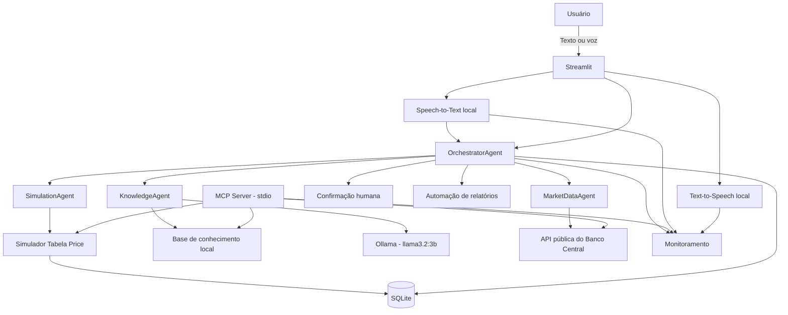

# CreditAI

**Assistente inteligente de crédito com IA local, RAG, multiagentes, MCP, voz e automações.**

O **CreditAI** é um projeto de portfólio desenvolvido em Python para demonstrar, em uma única aplicação, diferentes padrões usados em sistemas modernos de Inteligência Artificial: uso de modelo local, ferramentas determinísticas, RAG, orquestração multiagente, MCP, voz, persistência, observabilidade, avaliação automatizada e confirmação humana para ações sensíveis.

> **Projeto educacional.** O CreditAI não realiza contratação real de crédito, não movimenta dinheiro e não substitui orientação financeira profissional.

---

## Visão geral

A aplicação permite conversar com um assistente de crédito por **texto ou voz** e combinar, na mesma interação:

- simulação de crédito pela **Tabela Price**;
- explicações baseadas em uma **base de conhecimento local**;
- consulta da **Selic** por meio da API pública do Banco Central do Brasil;
- roteamento entre **agentes especializados**;
- persistência de histórico em **SQLite**;
- confirmação humana antes de ações demonstrativas sensíveis;
- monitoramento técnico de operações e latência;
- geração local de relatórios;
- exposição controlada de ferramentas por **MCP**;
- testes automatizados e cenários de avaliação.

O modelo de linguagem é executado localmente com **Ollama + `llama3.2:3b`**, sem dependência de API paga para o funcionamento principal.

---

## Principais funcionalidades

| Funcionalidade | Implementação |
| --- | --- |
| Chat com IA local | Ollama + `llama3.2:3b` |
| Simulação de crédito | Tabela Price com cálculo determinístico em Python |
| RAG / conhecimento local | Busca em documentos Markdown |
| Multiagentes | Orquestrador + agentes de simulação, conhecimento e mercado |
| Dados externos | API pública do Banco Central para consulta da Selic |
| MCP | Servidor local por `stdio` com ferramentas explicitamente permitidas |
| Voz | STT com `faster-whisper` e TTS local com `pyttsx3` |
| Memória e histórico | Estado de sessão + SQLite |
| Human-in-the-loop | Aprovação e cancelamento apenas por controles explícitos da interface |
| Observabilidade | Métricas de operações, agentes, APIs, MCP, STT e TTS |
| Avaliação | Cenários mock reproduzíveis e suíte de testes automatizados |
| Automação | Geração local de relatórios Markdown |

---

## Arquitetura



### Agentes especializados

| Agente | Responsabilidade |
| --- | --- |
| `OrchestratorAgent` | Interpreta a solicitação, valida o plano e encaminha tarefas |
| `SimulationAgent` | Valida dados e executa simulações de crédito |
| `KnowledgeAgent` | Recupera evidências da base local e produz explicações com fontes |
| `MarketDataAgent` | Consulta e apresenta o indicador Selic com fonte e data |

O orquestrador trabalha com um conjunto fixo de especialistas e limites de handoff. Não há carregamento dinâmico de agentes ou execução arbitrária de código.

---

## Exemplo de uso

Pergunta:

```text
O que é Tabela Price e quanto fica 5000 em 12x a 2%?
```

O fluxo pode envolver:

```text
Usuário
  ↓
OrchestratorAgent
  ├─→ KnowledgeAgent → base de conhecimento
  └─→ SimulationAgent → simulador Tabela Price
```

Para `R$ 5.000`, `12 parcelas` e `2% ao mês`, o simulador retorna:

```json
{
  "valor_solicitado": 5000.0,
  "parcelas": 12,
  "taxa_juros_mensal": 2.0,
  "valor_parcela": 472.8,
  "valor_total": 5673.58,
  "total_juros": 673.58
}
```

---

## Tecnologias

- **Python**
- **Streamlit**
- **Ollama**
- **llama3.2:3b**
- **SQLite**
- **pytest**
- **MCP Python SDK**
- **faster-whisper**
- **pyttsx3**
- **API pública do Banco Central do Brasil**
- **Markdown / JSON**

O projeto utiliza bibliotecas padrão do Python sempre que possível e mantém separadas as camadas de interface, agentes, ferramentas, integrações, persistência, avaliação e monitoramento.

---

## Estrutura do projeto

```text
credit-ai/
├── app.py
├── requirements.txt
├── README.md
├── actions/          # Confirmação humana e ações controladas
├── agent/            # Entrada principal do assistente e cliente Ollama
├── agents/           # Orquestrador e agentes especializados
├── automations/      # Geração de relatórios
├── database/         # Persistência SQLite
├── documents/        # Base de conhecimento local
├── evaluation/       # Cenários e avaliador
├── integrations/     # Integrações externas, como BCB
├── knowledge/        # Recuperação de conhecimento
├── mcp_server/       # Servidor MCP local
├── monitoring/       # Métricas técnicas
├── reports/          # Relatórios locais gerados
├── tests/            # Testes automatizados
├── tools/            # Ferramentas determinísticas
└── voice/            # Speech-to-Text e Text-to-Speech
```

---

## Como executar

### Pré-requisitos

- Python instalado;
- Ollama disponível localmente;
- modelo `llama3.2:3b` disponível no Ollama;
- Windows para a experiência de TTS configurada atualmente;
- internet apenas para instalação inicial de dependências/modelos e para a consulta opcional à API do Banco Central.

### 1. Criar o ambiente e instalar as dependências

No PowerShell, dentro da pasta do projeto:

```powershell
python -m venv .venv
.\.venv\Scripts\python.exe -m pip install -r requirements.txt
```

### 2. Preparar o modelo de voz

```powershell
.\.venv\Scripts\python.exe -m voice.speech_to_text --preparar
```

O download inicial do modelo de STT é feito uma única vez. Depois da preparação, STT e TTS podem funcionar localmente.

### 3. Iniciar a aplicação

```powershell
.\.venv\Scripts\python.exe -m streamlit run app.py
```

Abra o endereço local exibido pelo Streamlit no navegador.

---

## Testes e avaliação

### Testes automatizados

```powershell
.\.venv\Scripts\python.exe -m pytest tests -q -p no:cacheprovider
```

### Avaliação controlada

```powershell
.\.venv\Scripts\python.exe -m evaluation.evaluator --modo mock
```

Na última verificação documentada do projeto:

- **329 testes automatizados aprovados**;
- **62 cenários mock aprovados**;
- aplicação Streamlit respondendo localmente com sucesso.

Os testes utilizam fakes e bancos temporários quando necessário, evitando dependência do Ollama real, microfone ou internet para grande parte da suíte.

---

## MCP

O CreditAI também disponibiliza um servidor MCP local por `stdio`.

Ferramentas expostas:

| Ferramenta | Função |
| --- | --- |
| `simular_credito` | Executa a simulação pela Tabela Price |
| `consultar_selic` | Consulta o indicador anual no cliente BCB |
| `buscar_conhecimento` | Recupera trechos reais da base local |

Execução:

```powershell
.\.venv\Scripts\python.exe -m mcp_server.server
```

Teste local do protocolo:

```powershell
.\.venv\Scripts\python.exe -m mcp_server.smoke_test
```

O servidor utiliza uma lista explícita de ferramentas permitidas e não expõe aprovação de propostas, execução de shell ou URLs arbitrárias.

---

## Consulta da Selic

A integração com o Banco Central utiliza a série SGS **1178 — Taxa de juros - Selic anualizada base 252**.

A Selic é tratada apenas como **indicador econômico de referência**. O CreditAI não converte automaticamente a taxa anual em taxa mensal de empréstimo e não a utiliza como oferta de crédito.

A simulação sempre exige a taxa mensal de crédito explicitamente informada pelo usuário.

---

## Voz local

O CreditAI permite interação por voz sem utilizar APIs externas de STT/TTS:

```text
Microfone
  ↓
faster-whisper
  ↓
mesmo fluxo do chat
  ↓
OrchestratorAgent
  ↓
resposta textual
  ↓
pyttsx3
```

O áudio temporário é removido após o processamento. A transcrição passa pelas mesmas validações e restrições do chat por texto.

A fala nunca substitui o clique de confirmação humana para ações sensíveis.

---

## Segurança e limites

Algumas decisões adotadas no projeto:

- ferramentas e agentes trabalham com **allowlists explícitas**;
- o MCP não executa comandos arbitrários;
- o cliente do BCB utiliza endpoint fixo;
- falhas de integrações não são substituídas por valores inventados;
- ações sensíveis continuam dependentes de confirmação humana;
- áudio não é persistido permanentemente;
- prompts, mensagens e conteúdo de áudio não são gravados nas métricas técnicas;
- cálculos financeiros são executados por código determinístico, e não pelo LLM.

Essas medidas não transformam o projeto em um sandbox de segurança ou em uma plataforma financeira pronta para produção, mas demonstram práticas de redução de superfície de risco.

---

## O que este projeto demonstra

O CreditAI foi construído para praticar e demonstrar conhecimentos em:

- desenvolvimento Python;
- integração de modelos de linguagem;
- IA local;
- tool calling;
- RAG;
- arquiteturas multiagente;
- Model Context Protocol;
- integração com APIs;
- persistência de dados;
- processamento de voz;
- automações;
- observabilidade;
- testes automatizados;
- avaliação de sistemas de IA;
- human-in-the-loop;
- desenho de limites e validações de segurança.

---

## Status

O projeto possui uma implementação funcional local com interface Streamlit, IA local, simulação, RAG, multiagentes, MCP, voz, persistência, integração com o Banco Central, monitoramento, avaliação e automações.

Próximas melhorias de portfólio incluem demonstrações visuais, refinamento da documentação e evolução da experiência da interface.

---

## Autor

**Thiago Pereira dos Santos Alexandre**

GitHub: [ThiagoAlexandre33](https://github.com/ThiagoAlexandre33)

---

> Este repositório foi desenvolvido para fins educacionais e de portfólio. Não representa uma instituição financeira e não oferece, aprova ou contrata crédito real.
